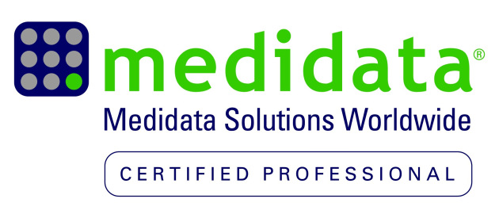

  

  
  

</pre>
⚙️ Languages and Tools :

💻Programming : Python SAS R SQL

🖴 Databases: PostgreSQL Mysql SQLite ❄️Snowflake Oracle SQLServer

☁🌨️ Cloud : AWS GCP 

📈Data & ML: Scikitlearn Keras Powerbi Tableau

🕸️Web Dev : HTML5 CSS3 Javascript Streamlit ReactPy Django

⛏️ Tools : Git GitLab Jira

--------------------------------------------------------------
- 👋 Hi, I’m Aaliyah Raderberg
- 👀 I’m interested in collaborating in projects using Python, SAS or any clinical research application.
- 🌱 I’m currently learning APIs using Python, Pandas, Jupiter, R coding, Data Visualization, and Machine Learning...
- 💞️ I’m looking to collaborate on clinical research / data management projects.
- 📫 How to reach me: aaliyah.raderberg [at] proton [dot] me

> 🔗 Other resources:
> [Visit my blog](https://aaliyahraderberg.wordpress.com/) | 
  [Visit my Data Visualizaton projects](https://public.tableau.com/app/profile/aaliyahraderberg/vizzes) | [LinkedIn](https://www.linkedin.com/in/aaliyahraderberg/) | [Kaggle](https://www.kaggle.com/aaliyahraderberg)
  
  
 

   
   

 

  
   
 

 
 
<!---
araderberg/araderberg is a ✨ special ✨ repository because its `README.md` (this file) appears on your GitHub profile.
You can click the Preview link to take a look at your changes.
--->
