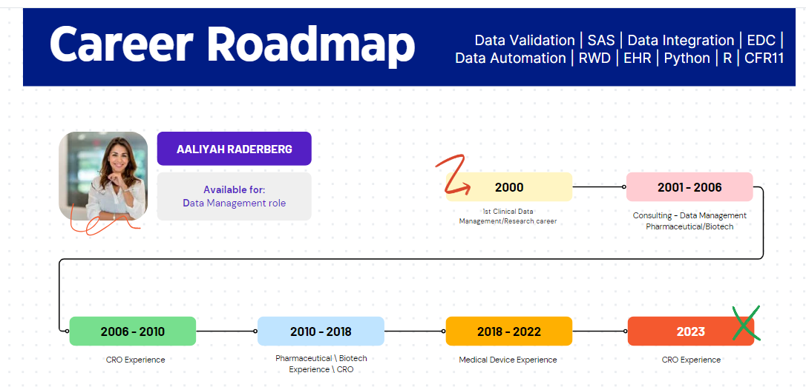

  

  
  

--------------------------------------------------------------
- 👋 Hi, I’m @araderberg
- 👀 I’m interested in collaborating in projects using Python, SAS or any clinical research application.
- 🌱 I’m currently learning APIs using Python, Pandas, Jupiter, R coding, Data Visualization, and Machine Learning...
- 💞️ I’m looking to collaborate on clinical research / data management projects.
- 📫 How to reach me: datamanagersasprogrammer [at] protonmail [dot] ch
- 🔗 Other resources:
  [Visit my blog](https://aaliyahraderberg.wordpress.com/) | 
  [Visit my Data Visualizaton projects](https://public.tableau.com/app/profile/aaliyahraderberg/vizzes) | [LinkedIn](https://www.linkedin.com/in/ikhouvanwesties/)
  
 

  
 

 

<!---
araderberg/araderberg is a ✨ special ✨ repository because its `README.md` (this file) appears on your GitHub profile.
You can click the Preview link to take a look at your changes.
--->
